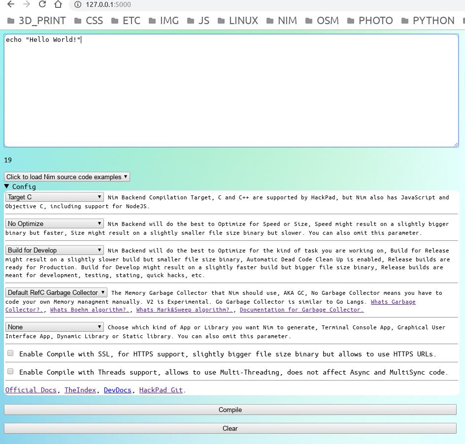
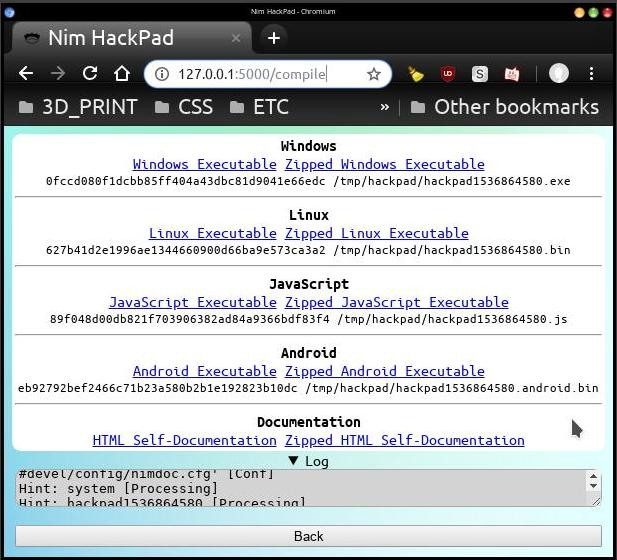

# Nim-HackPad

- Hackathon Web Scratchpad for teaching Nim on events using Wifi with limited or no Internet.






# Install

- `nimble install hackpad`


# Use

- `./hackpad`


# CrossCompilation On Demand

**This is for Local Offline Wifi or LAN only.**

The Web App will reply any valid `*.nim` plain text source code file with
CrossCompiled stripped native binary executables for Linux and Windows,
including the SHA1 CheckSums directly on the browser (it compiles, does not run).

No extra hardening security features are in place for this feature,
because the Web App is designed to be used on **Local Offline Wifi or LAN**,
on Hackathons, HackLabs, Meetups, Workshops, and IRL Events,
check `firejails` or `docker` for this, disable if you expect malware code.

[For a better online solution check Nim Playground!.](https://play.nim-lang.org)


# Requisites

Linux -> Windows CrossCompile, this allows to generate a `*.EXE` for Windows on Linux.

On Linux install all this packages:

```
mingw-w64-binutils mingw-w64-crt mingw-w64-gcc mingw-w64-headers mingw-w64-winpthreads mingw-w64-gcc-base mingw-w64-*
```

Usually only installing `mingw-w64-gcc` gets all the rest as dependency.

Names are from ArchLinux AUR, should be similar on other Distros.
